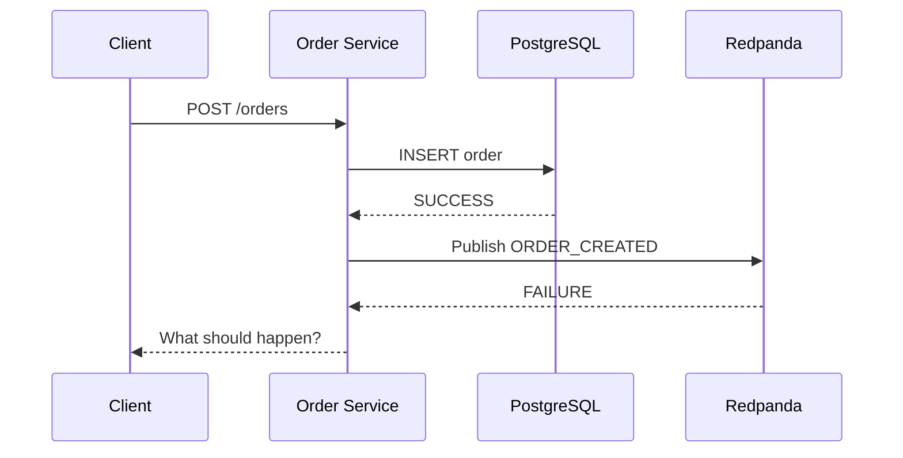
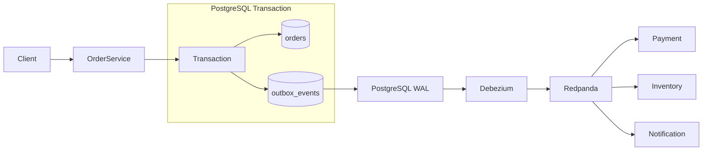
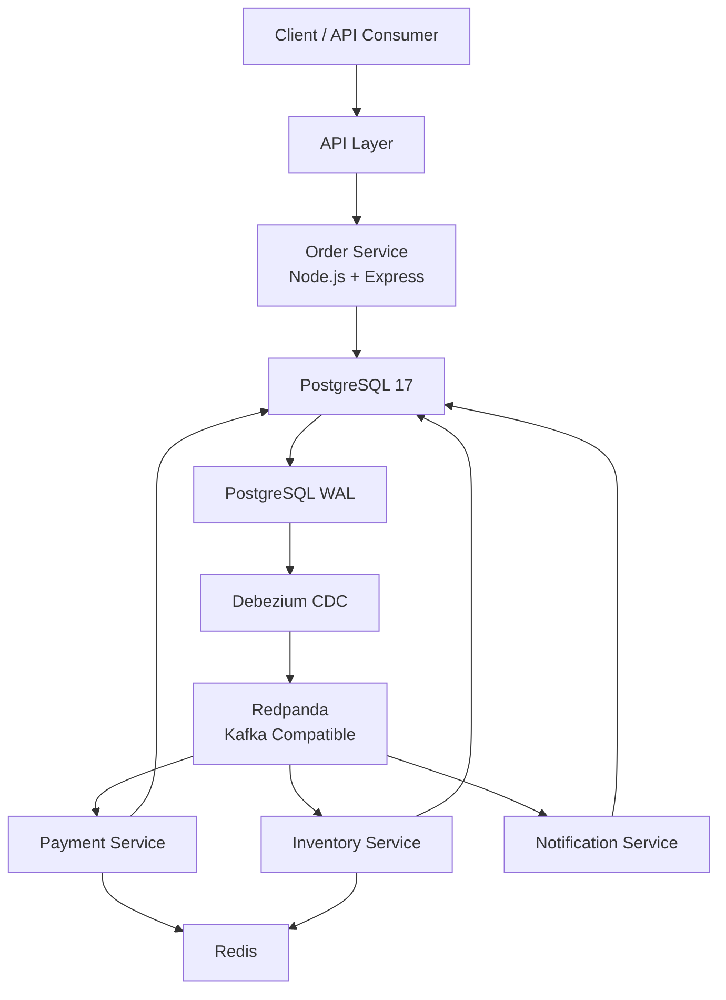
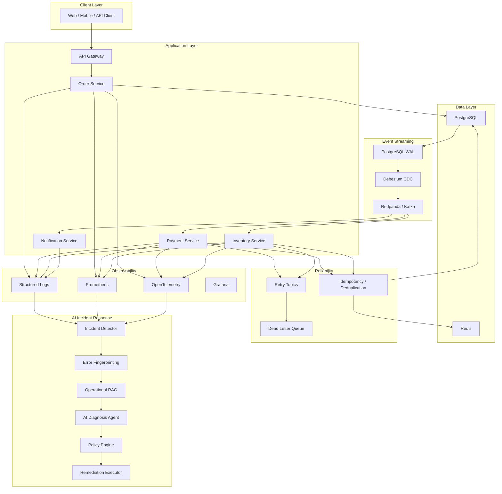
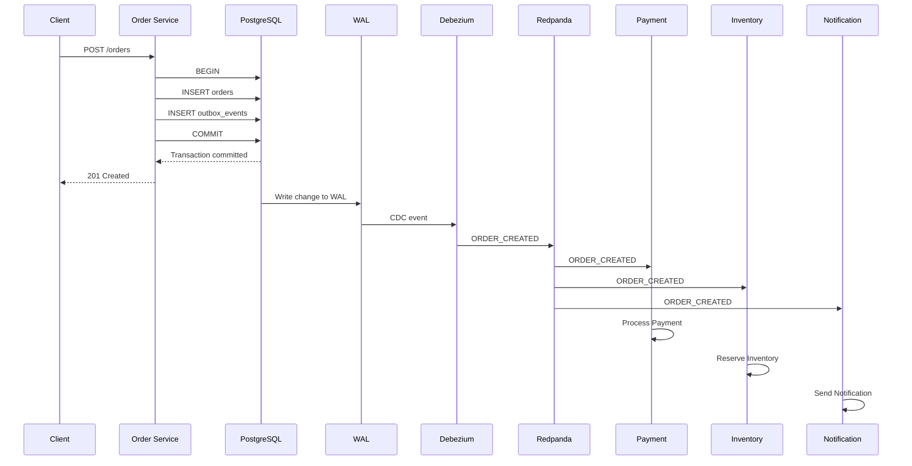
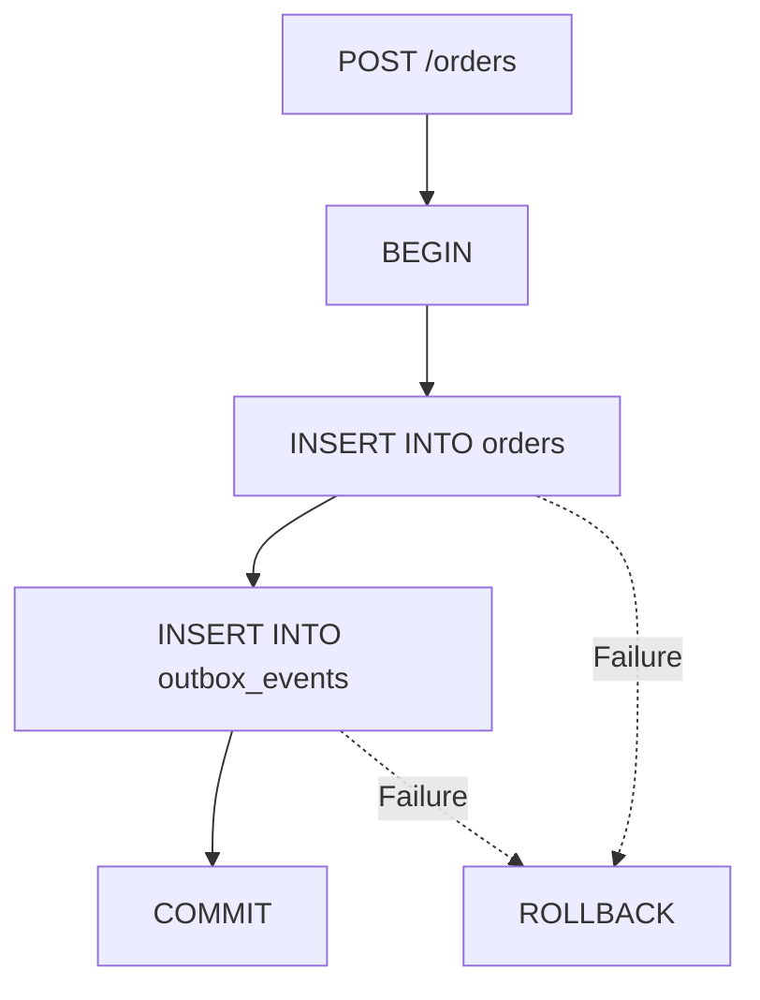
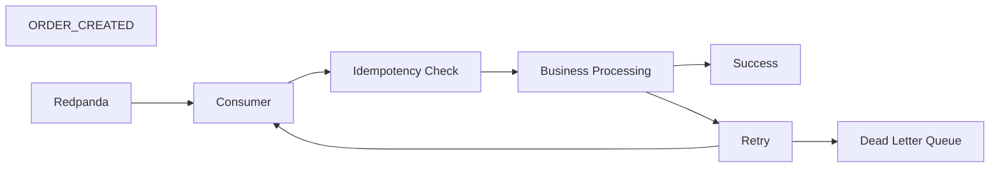
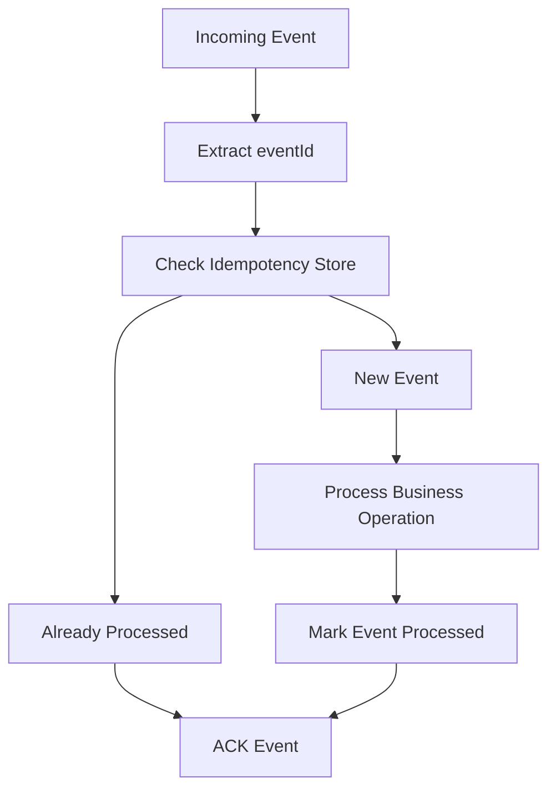
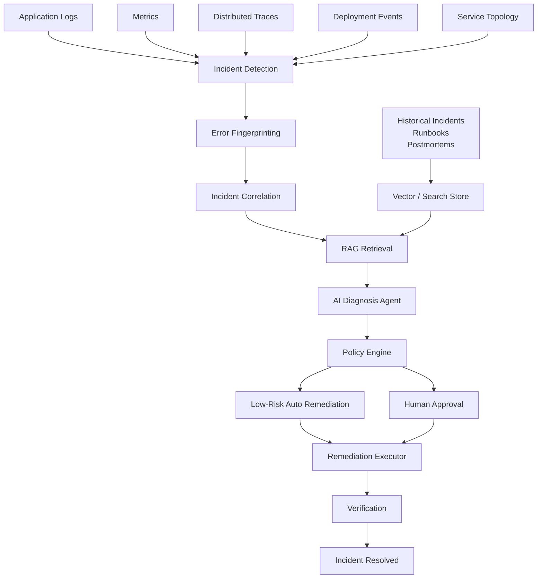

# 🚀 Distributed Transactional Outbox & AI-Assisted Order Processing Platform

> A fault-tolerant, event-driven distributed order processing platform built with Node.js, PostgreSQL, Debezium CDC, Redpanda, Redis, Docker, and an AI-powered incident response layer.

---

## 📌 Table of Contents

- [Overview](#-overview)
- [Problem Statement](#-problem-statement)
- [Solution](#-solution)
- [Key Objectives](#-key-objectives)
- [Architecture](#-architecture)
- [Complete System Flow](#-complete-system-flow)
- [Transactional Outbox Flow](#-transactional-outbox-flow)
- [CDC Flow](#-cdc-flow)
- [Event Processing Flow](#-event-processing-flow)
- [Idempotency Flow](#-idempotency-flow)
- [Retry and DLQ Flow](#-retry-and-dlq-flow)
- [AI Incident Response Architecture](#-ai-incident-response-architecture)
- [Technology Stack](#-technology-stack)
- [Project Structure](#-project-structure)
- [Infrastructure](#-infrastructure)
- [Database Design](#-database-design)
- [Services](#-services)
- [API](#-api)
- [Event Schema](#-event-schema)
- [Reliability Model](#-reliability-model)
- [Failure Scenarios](#-failure-scenarios)
- [Observability](#-observability)
- [AI/RAG Layer](#-airag-layer)
- [Security](#-security)
- [Local Development](#-local-development)
- [Testing](#-testing)
- [Implementation Phases](#-implementation-phases)
- [Performance Goals](#-performance-goals)
- [Future Improvements](#-future-improvements)
- [Interview Talking Points](#-interview-talking-points)
- [License](#-license)

---

# 🧠 Overview

The **Distributed Transactional Outbox & AI-Assisted Order Processing Platform** is a production-oriented distributed backend system designed to solve reliability and consistency problems that occur when multiple microservices communicate through asynchronous events.

The platform demonstrates:

- Transactional Outbox Pattern
- PostgreSQL Write-Ahead Logging (WAL)
- Change Data Capture (CDC)
- Debezium
- Kafka-compatible event streaming using Redpanda
- At-least-once event delivery
- Idempotent consumers
- Redis-based deduplication
- Retry mechanisms
- Exponential backoff
- Dead Letter Queues
- Failure recovery
- Distributed tracing
- Metrics and structured logging
- Incident detection
- RAG-based operational knowledge retrieval
- AI-assisted incident diagnosis
- Controlled self-healing

The core objective is:

> **Guarantee that important business state changes and their corresponding events are persisted reliably, while making downstream event processing resilient to duplicates, failures, retries, and service outages.**

---

# ❗ Problem Statement

In a distributed system, an Order Service often needs to perform two operations:

1. Store the order in a database.
2. Publish an event to a message broker.

A naive implementation might look like:

```text
Client
   |
   v
Order Service
   |
   +------------------+
   |                  |
   v                  v
PostgreSQL          Kafka
   |                  |
   |                  |
Save Order       Publish Event
```



The order exists, but the event was lost.
The opposite failure is also possible:
Kafka event → SUCCESS
Database transaction → FAILURE

## Solution
This project solves the dual-write problem using the:
Transactional Outbox Pattern
Instead of directly writing to PostgreSQL and Redpanda independently, the Order Service writes:
1. The business entity.
2. The event that represents the state change.
into PostgreSQL within the same database transaction.



## Key Objectives
The system is designed around the following objectives:
Reliability
Prevent loss of important business events.
Consistency
Ensure database state and event state remain consistent.
Fault Tolerance
Recover from temporary failures.
Idempotency
Prevent duplicate processing.
Scalability
Allow consumers to scale horizontally.
Observability
Understand what is happening across services.
AI-Assisted Operations
Use historical operational knowledge and AI to diagnose incidents.

## 🏗 Architecture
### High-Level Architecture



### 🌐 Complete System Architecture



## Complete System Flow
When a client creates an order:



## Transactional Outbox Flow
The critical transaction is:



## CDC Flow
PostgreSQL uses a Write-Ahead Log.
The simplified flow is:

```text
PostgreSQL Transaction
        |
        v
PostgreSQL WAL
        |
        v
Debezium
        |
        v
Redpanda
        |
        v
Consumers
```

### WAL
WAL stands for:
Write-Ahead Log
PostgreSQL records database changes in the WAL before final persistence.
Debezium reads these logical changes and converts them into events.

## Event Processing Flow



## Idempotency
The system assumes at-least-once delivery.
Therefore an event can arrive multiple times.



## Retry System
Not every failure should immediately go to a DLQ.
Transient errors should be retried.
Examples:
- Database timeout
- Network timeout
- Temporary service unavailable
- Temporary broker failure

### Exponential Backoff
Example:
Attempt 1 → 0 sec
Attempt 2 → 1 sec
Attempt 3 → 2 sec
Attempt 4 → 4 sec
Attempt 5 → 8 sec
Jitter should be added in production to avoid synchronized retry storms.

## ☠️ Dead Letter Queue
If an event repeatedly fails:
```text
Main Topic
    |
    v
Consumer
    |
    v
Retry
    |
    v
Retry
    |
    v
Retry
    |
    v
Maximum Attempts
    |
    v
DLQ
```

A DLQ event should retain:
- Event ID
- Original event
- Failure reason
- Retry count
- Service name
- Timestamp
- Error metadata

Example:
```json
{
  "eventId": "abc-123",
  "eventType": "ORDER_CREATED",
  "retryCount": 5,
  "service": "payment-service",
  "error": "Payment provider timeout",
  "failedAt": "2026-09-04T12:00:00Z"
}
```

## AI Incident Response Architecture
The AI layer is intentionally outside the critical order-processing path.
The core business system remains deterministic.



## Technology Stack

| Technology | Purpose |
| ---------- | ------- |
| Node.js | Backend runtime |
| Express.js | REST API |
| PostgreSQL 17 | Primary database |
| PostgreSQL WAL | CDC source |
| Debezium | Change Data Capture |
| Redpanda | Kafka-compatible event streaming |
| Redis 8 | Fast deduplication/idempotency |
| Docker | Local infrastructure |
| Docker Compose | Multi-container orchestration |
| OpenTelemetry | Distributed tracing |
| Prometheus | Metrics |
| Grafana | Dashboards |
| Loki / Logging System | Centralized logs |
| Vector Database | RAG knowledge retrieval |
| LLM | Incident diagnosis |
| Kubernetes | Future production orchestration |

## Project Structure
(To be implemented)

## Infrastructure
(To be implemented)

## Database Design
(To be implemented)

## Services
(To be implemented)

## API
(To be implemented)

## Event Schema
(To be implemented)

## Reliability Model
(To be implemented)

## Failure Scenarios
(To be implemented)

## Observability
(To be implemented)

## AI/RAG Layer
(To be implemented)

## Security
(To be implemented)

## Local Development
(To be implemented)

## Testing
(To be implemented)

## Implementation Phases
(To be implemented)

## Performance Goals
(To be implemented)

## Future Improvements
(To be implemented)

## Interview Talking Points
(To be implemented)

## License
(To be implemented)
